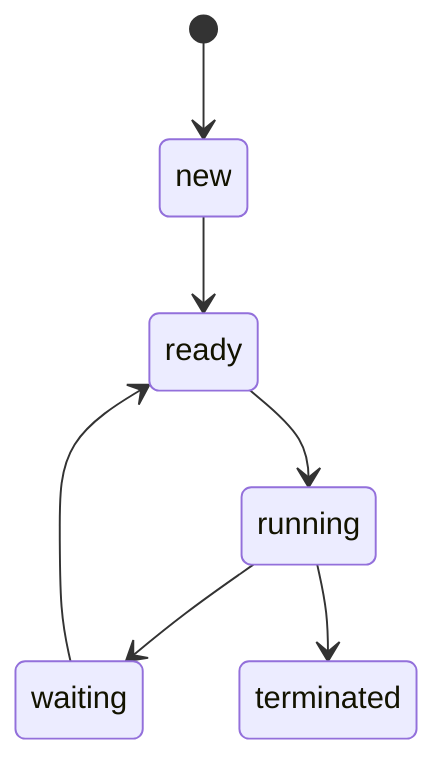

# 📘 Chapter 1: [Introduction]

| 항목              | 내용                                                                                                                         |
| ----------------- | ---------------------------------------------------------------------------------------------------------------------------- |
| 운영체제의 역할   | 사용자와 컴퓨터 하드웨어 사이의 중재자 역할 수행                                                                             |
| 운영체제의 목적   | 프로그램을 **편리하고 효율적으로 실행**할 수 있는 환경 제공                                                                  |
| 운영체제의 정의   | 컴퓨터 하드웨어를 관리하는 소프트웨어                                                                                        |
| 하드웨어와의 관계 | 하드웨어는 운영체제가 시스템을 **정확하고 안정적으로 작동**하게 할 수 있도록 메커니즘을 제공해야 함                          |
| 설계 다양성       | 운영체제는 다양한 설계 방식으로 구성될 수 있음                                                                               |
| 설계 전 고려사항  | **운영체제의 목표를 명확히 정의**한 후에 설계를 시작해야 함                                                                  |
| 개발 방식         | 운영체제는 복잡하고 크기 때문에 **작은 단위로 나누어** 개발해야 하며, 각 구성 요소는 **명확한 입력, 출력, 기능**을 가져야 함 |

---

## 📌 1. 핵심 개념 요약

operating system ? 하드웨어를 관리하는 소프트웨어
-> CPU, memory, and I/O devices, as well as storage

### 1.1 What Operating Systems Do

컴퓨터 시스템 4가지 - hardware, operating system, application programs, user

- hardware - CPU, memory, I/O devices
- application programs - user's computing problems를 해결하기 위해 사용되는 자원.
  -> operating system이 다양한 유저들을 위해 이런 하드웨어나 프로그램들을 다룬다.

An operating system is similar to a government.

[Figure 1.1]

유저와 시스템의 관점으로 살펴보자.

#### 1.1.1 User View

인터페이스 - touch screen, voice recognition
목적은 유저가 수행하는 작업들을 극대화시키는 것이다.
유저 관점에서 운영체제는 주로 사용의 편의성(ease of use)을 중심으로 설계됨.
성능과 보안에는 어느 정도 신경을 썼지만, 자원 활용(resource utilization) — 다양한 하드웨어와 소프트웨어 자원이 어떻게 공유되는지 — 에 대해서는 거의 고려하지 않았다.

user view X - embedded computers

#### 1.1.2 System View

resource allocator - problem: CPU time, memory space, storage space, I/O devices ...
-> efficiently and fairly

control program - user program들의 실행 관리 (I/O devices)

#### 1.1.3 Defining Operating Systems

무어의 법칙 → 컴퓨터의 발전(고성능 + 소형화) → 다양한 사용처 → 다양한 운영체제

Operating System?

- The common functions of controlling and allocating resources
- 포함된 기능(feature) 은 시스템마다 매우 다양하게 달라진다.
- 운영체제는 컴퓨터에서 항상 실행되고 있는 하나의 프로그램이며, 이것을 커널(kernel) 이라 부름.
- "운영체제 = 커널 + 시스템 프로그램"으로 말하기도 한다.

  1. 시스템 프로그램(system programs)
     운영체제와 관련은 있지만, 반드시 커널의 일부는 아니다.

  2. 응용 프로그램(application programs)
     시스템의 동작과는 관련이 없는 모든 프로그램.

모바일 운영체제는 보통 핵심 커널(core kernel) 뿐만 아니라, 미들웨어(middleware) 도 포함되어 있다.
미들웨어란?

> 애플리케이션 개발자에게 추가적인 서비스를 제공하는 소프트웨어 프레임워크.

### 1.2 Computer-System Organization

computer system은 system bus 형태로 CPU들과 device controller들을 연결하는 것이 목표.
[Figure 1.2]

디바이스 컨트롤러

- 몇몇 local buffer storage와 특수 목적 Register들의 모임을 포함한다.
- 자신이 제어하는 주변 장치와 로컬 버퍼 사이의 데이터 이동을 담당한다.
- 각 디바이스 컨트롤러는 device driver 를 가진다.

디바이스 드라이버

- 해당 디바이스 컨트롤러를 이해하고, 운영체제 나머지 부분에 장치에 대한 일관된 인터페이스를 제공.

메모리 컨트롤러

- CPU와 디바이스 컨트롤러는 메모리 사이클을 병렬로 실행하여 메모리 경쟁이 발생할 수 있다.
- 메모리 컨트롤러가 메모리 접근을 synchronize하여 질서 있는 접근을 보장한다.

Three Keys

1. 인터럽트 (Interrupts): CPU에 즉각적인 주의가 필요한 사건이 발생했음을 알리는 신호.
2. 저장 구조 (Storage Structure): 데이터를 어떻게 저장하고 관리하는지에 대한 구조.
3. 입출력 구조 (I/O Structure): 장치 간의 데이터 이동이 어떻게 이루어지는지에 대한 구조.

#### 1.2.1 Interrupts

I/O 요청 -> 디바이스 드라이버가 디바이스 컨트롤러의 register에 명령 적재 -> 디바이스 컨트롤러에서 어떤 액션을 해야하는지 결정하는 register들을 조사 -> 디바이스 컨트롤러가 명령을 읽고 실행 -> 완료 되면, 디바이스 컨트롤러는 디바이스 드라이버에게 알림 -> 디바이스 드라이버는 작업 결과를 운영체제에 전달

💡 핵심 포인트

- 인터럽트는 I/O 작업이 끝났을 때, 디바이스 컨트롤러가 디바이스 드라이버에게 알려주는 방식
- 덕분에 CPU는 대기하지 않고 다른 일을 하다가, 작업 완료 시 알림(Interrupt) 을 받고 처리 가능

예시:

💡 운영체제 비유로 이해하기

- 커널 = 자동차의 엔진
- 시스템 프로그램 = 계기판, 핸들, 네비게이션
- 응용 프로그램 = 노래 어플리케이션
- 운영체제 전체 = 자동차 전체 (운전할 수 있도록 도와주는 모든 요소 포함)

---

## 📊 2. 주요 도식화

### ✅ 상태 전이 예시

