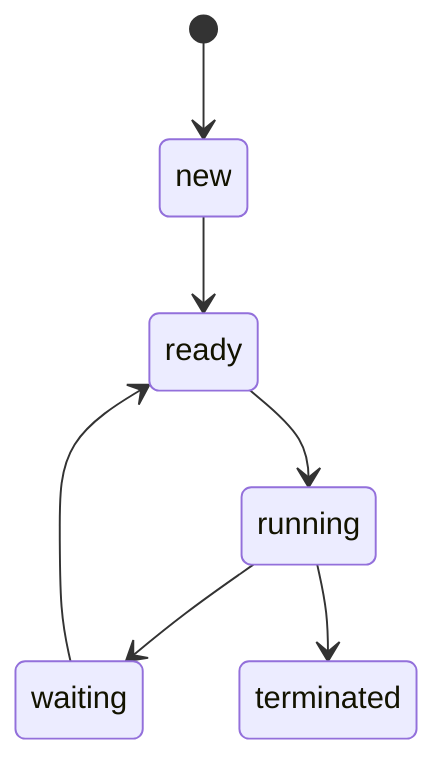

# 📘 Chapter X: [Chapter Title]

> 이 장에서는 운영체제의 [핵심 개념 요약 한 줄]에 대해 학습합니다.

---

## 📌 1. 핵심 개념 요약

| 개념  | 설명        |
| ----- | ----------- |
| 개념1 | 간단한 설명 |
| 개념2 | 간단한 설명 |
| ...   | ...         |

예시:

- **Process**: 실행 중인 프로그램으로, 고유한 주소 공간과 PCB를 가짐
- **Thread**: 프로세스 내의 실행 단위, 스택은 독립적이나 코드, 데이터는 공유함
- **Context Switch**: CPU가 다른 프로세스로 전환할 때 필요한 상태 저장/복원 작업

---

## 📊 2. 주요 도식화

### ✅ 상태 전이 예시

